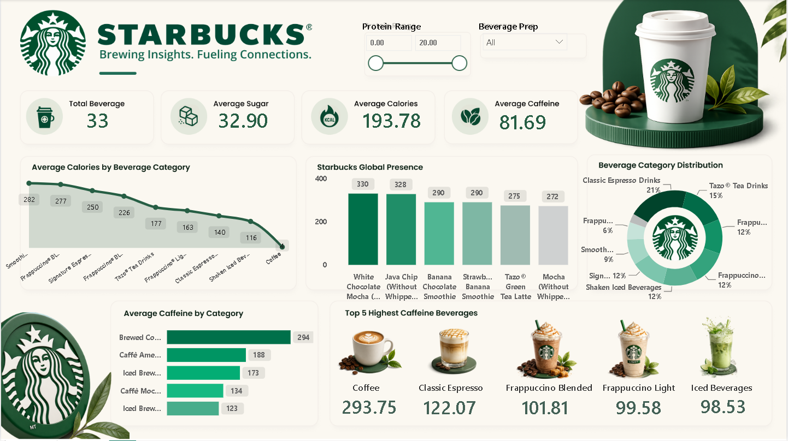

# ☕ Starbucks Beverage Analytics Dashboard

An interactive Power BI dashboard analyzing Starbucks' beverage menu — covering calories, sugar, caffeine, and category-wise distribution across 30+ beverages, built to uncover nutritional insights and consumption trends.



---

## 📌 Overview

This project transforms raw Starbucks nutrition data into a clean, interactive Power BI dashboard. It highlights key metrics like average calories, sugar, and caffeine content, ranks the highest-caffeine beverages, and breaks down the menu by beverage category — all with dynamic filtering via slicers.

**Live goal:** Help identify calorie-heavy vs. low-calorie options, compare caffeine strength across drink types, and visualize how Starbucks' menu is distributed across categories.

---

## 🖼️ Dashboard Preview

| Section | Insight |
|---|---|
| KPI Cards | Total Beverages, Avg Sugar, Avg Calories, Avg Caffeine |
| Average Calories by Category | Line chart trend across categories |
| Starbucks Global Presence | Top beverages ranked by average calories |
| Beverage Category Distribution | Donut chart share of each category |
| Average Caffeine by Category | Horizontal bar ranking |
| Top 5 Highest Caffeine Beverages | Visual card ranking with images |

---

## ✨ Features

- 🎛️ **Interactive slicers** — filter by Protein Range and Beverage Prep
- 📊 **Dynamic DAX measures** — Avg Caffeine, Avg Calories, Avg Sugar, Total Beverages
- 🏆 **Top N ranking visuals** — highest calorie & caffeine beverages
- 🍩 **Category-wise breakdown** — donut chart with % distribution
- 🎨 **Custom Starbucks-themed UI** — brand colors, logo, and imagery
- 📱 Responsive layout (desktop view optimized)

---

## 🛠️ Tech Stack

- **Tool:** Microsoft Power BI Desktop
- **Data Cleaning:** Power Query (M Language)
- **Calculations:** DAX (Data Analysis Expressions)
- **Data Source:** Starbucks beverage nutrition dataset (CSV)

---

## 📂 Data Source

| File | Description |
|---|---|
| `starbucks.csv` | Beverage-level nutrition data — Calories, Sugar, Caffeine, Protein, etc. |
| `directory.csv` | Starbucks store directory (Country, City, Brand) |

> Data cleaned and transformed using Power Query — removed nulls/duplicates, standardized column names, and fixed data types before modeling.

---

## 🧮 DAX Measures

```dax
Avg Caffeine = AVERAGE(starbucks[Caffeine (mg)])

Avg Calories = AVERAGE(starbucks[Calories])

Avg Sugar = AVERAGE(starbucks[Sugars (g)])

Total Beverages = DISTINCTCOUNT(starbucks[Beverage])
```

---

## 🔍 Key Insights

- ☕ **Brewed Coffee** has the highest average caffeine content (294 mg) — more than double a Classic Espresso.
- 🍫 **White Chocolate Mocha** tops the calorie chart at 330 kcal average.
- 📊 **Classic Espresso Drinks** make up the largest share (21%) of the beverage category distribution.
- ⚖️ Average calories across all beverages sit at ~194 kcal, with sugar averaging ~33g.

---

## 📁 Folder Structure

```
Starbucks-PowerBi-Dashboard/
│
├── data/
│   ├── starbucks.csv               # Beverage nutrition data
│   └── directory.csv               # Store directory data
├── assets/
│   └── dashboard_preview.png       # Dashboard screenshot for README
├── README.md                       # Project documentation
└── LICENSE                         # License file
```

## 👤 Author

**[Robin Pandit]**
📧 panditrobin514@gmail.com
🔗 [LinkedIn](https://www.linkedin.com/in/robin-pandit-9a6860373/) 

---

## 📄 License

This project is licensed under the MIT License — feel free to use, modify, and share with attribution.

---

⭐ If you found this project useful, consider giving it a star on GitHub!
